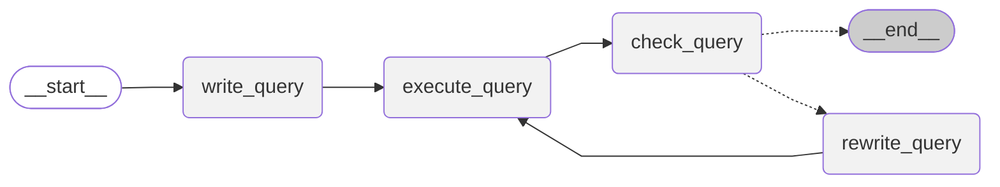

# 使用 Agent-lightning 和 VERL 训练 SQL Agent

本指南基于 **Agent-lightning v0.2 SQL Agent** 示例，并解释系统组件如何集成：一个基于 [`LangGraph`](https://langchain-ai.github.io/langgraph/) 的 SQL agent 被包装为 [`LitAgent`][agentlightning.LitAgent]，使用 [`VERL`][agentlightning.algorithm.verl.VERL] 强化学习（RL）算法，以及协调训练和调试的 [`Trainer`][agentlightning.Trainer]。

命令行接口 [`examples/spider/train_sql_agent.py`]({{ src("examples/spider/train_sql_agent.py") }}) 提供了一个完整的可运行示例。但本文档重点在于理解底层架构，以便您可以有效地将工作流程适配到自己的 agents 上。

## SQL Agent 架构

Agent-lightning 可以无缝集成各种编排框架，包括 [Agent Framework](https://github.com/microsoft/agent-framework)、[AutoGen](https://github.com/microsoft/autogen)、[CrewAI](https://www.crewai.com/)、[LangGraph](https://github.com/langchain-ai/langgraph) 和 [OpenAI Agents SDK](https://github.com/openai/openai-agents-python)。它也可以与自定义 Python 逻辑互操作。

在这个例子中，**LangGraph** 定义了一个循环工作流，模拟分析师迭代开发 SQL 的过程。下图（直接从 [`sql_agent.py`]({{ src("examples/spider/sql_agent.py") }} 渲染）展示了 agent 如何起草、执行、审查和优化查询，直到达到满意的结果。



!!! note

    工作流程通过以下阶段进行：

    1. **write_query** – 根据用户问题和数据库模式生成初始 SQL 查询。
    2. **execute_query** – 对目标数据库执行生成的查询。
    3. **check_query** – 使用专门的提示（`CHECK_QUERY_PROMPT`）评估查询及其结果（或错误）来检测问题。
    4. **rewrite_query** – 如果发现问题，agent 会根据上一步的反馈重写查询并重新进入循环。
    5. **END** – 当查询被验证或者达到最大迭代次数（`max_turns`）时，循环终止。每个 *turn* 包含一次完整的 `write_query`、`execute_query`、`check_query` 和（如果适用）`rewrite_query` 阶段循环。

在本教程中，**强化学习（RL）**用于优化 `write_query` 和 `rewrite_query` 阶段。虽然 `check_query` 步骤共享相同的底层 LLM 权重，但其跟踪数据不用于学习。

为了保持设计模块化和可维护性，建议在单独的文件中定义基于 LangGraph 的 SQL Agent，并通过构建函数暴露，例如：

```python
def build_langgraph_sql_agent(
    database_path: str,
    openai_base_url: str,
    model: str,
    sampling_parameters: Dict[str, Any],
    max_turns: int,
    truncate_length: int
):
    builder = StateGraph(State)
    builder.add_node(write_query)
    ...

    builder.add_edge(START, "write_query")
    ...

    return builder.compile().graph()
```

这种方法将您的 LangGraph 逻辑与 Agent-lightning 版本更改隔离开来，提高了可读性和可调试性。

## 连接 LangGraph 和 Agent-lightning

!!! tip

    在阅读本节时，请将 [`sql_agent.py`]({{ src("examples/spider/sql_agent.py") }}) 放在一边。这将帮助您理解此处显示的代码片段在实践中是如何工作的。

在 [`sql_agent.py`]({{ src("examples/spider/sql_agent.py") }}) 中定义的 **`LitSQLAgent`** 类充当桥梁。它继承了 [`agl.LitAgent`][agentlightning.LitAgent]，允许运行器为每次 rollout 提供共享资源（例如 [LLMs][agentlightning.LLM]）。

以下是关键逻辑的简化说明（注意：这是概念性的伪代码；实际实现包含特定于数据集的详细信息）：

```python
class LitSQLAgent(agl.LitAgent[Dict[str, Any]]):

    def __init__(self, max_turns: int, truncate_length: int):
        # 这里的每个 turn 指的是 write/exe/check/rewrite 的完整周期
        self.max_turns = max_turns
        self.truncate_length = truncate_length

    def rollout(
        self,
        task: Dict[str, Any],
        resources: agl.NamedResources,
        rollout: agl.Rollout
    ) -> float | None:
        llm: agl.LLM = resources["main_llm"]
        agent = build_langgraph_sql_agent(
            database_path="sqlite:///" + task["db_id"],
            max_turns=self.max_turns,
            truncate_length=self.truncate_length,
            openai_base_url=llm.get_base_url(rollout.rollout_id, rollout.attempt.attempt_id),
            model=llm.model,
            sampling_parameters=llm.sampling_parameters,
        )
        result = agent.invoke({"question": question}, {
            "callbacks": [self.tracer.get_langchain_handler()],
            "recursion_limit": 100,
        })
        reward = evaluate_query(result["query"], ground_truth, db_path, raise_on_error=False)
        return reward
```

`LitSQLAgent` 是围绕 LangGraph agent 的轻量级包装器，为 [`rollout`][agentlightning.LitAgent.rollout] 方法提供了正确的接口。它构建 LangGraph agent，调用它，并将评估结果作为奖励信号返回。

`"main_llm"` 资源键是 agent 和 [VERL][agentlightning.algorithm.verl.VERL] 之间的约定。在 rollout 期间，它用于注入来自 [VERL][agentlightning.algorithm.verl.VERL] 算法的 OpenAI 兼容端点。有两种方法可以使用这个 [agentlightning.LLM][] 资源：

1. **直接访问** – 使用 [`llm.endpoint`][agentlightning.LLM.endpoint] 进行简单集成（与 v0.1 示例相同）。
2. **上下文感知访问** – 使用 [`get_base_url`][agentlightning.ProxyLLM.get_base_url] 并结合 [`rollout.rollout_id`][agentlightning.Rollout.rollout_id] 和 [`rollout.attempt.attempt_id`][agentlightning.Attempt.attempt_id]。
   这种方法可以在运行器端追踪器不可用时启用每调用者追踪归属，改善每个 rollout 或尝试的追踪收集。有关详细信息，请参见[处理追踪](../tutorials/traces.md)。

## 奖励信号和评估

`evaluate_query` 函数提供 RL 训练的奖励机制。在 agent 训练中，获得一致且有意义的奖励信号通常具有挑战性。幸运的是，在使用 [**Spider 数据集**](https://yale-lily.github.io/spider) 时情况有所简化。该数据集包含约 8k 个样本，包含自然语言问题、数据库模式和真实 SQL 查询。

使用 [**Spider 评估器**](https://github.com/taoyds/test-suite-sql-eval)，执行 agent 生成的查询并与目标数据库上的真实查询进行比较。如果两个查询产生相同的执行结果，则认为它们是等效的。

!!! attention

    在训练过程中，真实查询绝不能暴露给 agent，以防止数据泄露。

在此设置中，奖励直接从 [`rollout`][agentlightning.LitAgent.rollout] 方法返回，使运行器能够将其转发回 RL 算法。

!!! warning

    避免同时使用 [`emit_reward`][agentlightning.emit_reward] 和返回奖励值。这样做会导致算法收到重复的奖励信号，导致不一致的训练行为。

## 配置 VERL 进行强化学习

查看 [`examples/spider/train_sql_agent.py`]({{ src("examples/spider/train_sql_agent.py") }}) 获取完整的强化学习配置，这是一个普通的 Python 字典。它反映了（实际上*就是*）用于在 VERL 框架中启动训练的 [shell 参数](https://verl.readthedocs.io/en/latest/index.html)，但更易于程序化调整：

```python
verl_config: Dict[str, Any] = {
    "algorithm": {"adv_estimator": "grpo", "use_kl_in_reward": False},
    "data": {
        # 这里不再需要 train_files 和 val_files
        # 因为数据是在 agl.Trainer 中读取的
        ...,
        # 控制每步池化的任务数
        # （乘以 actor_rollout_ref.rollout.n）
        "train_batch_size": 32,
        # 超过这些长度的提示和响应会被截断
        "max_prompt_length": 4096,
        "max_response_length": 2048,
    },
    "actor_rollout_ref": {
        "rollout": {
            # 目前仅支持 vLLM
            "name": "vllm",
            # 等同于 GRPO 的组大小
            "n": 4,
            # 用于在 vLLM 中启用工具调用解析器
            "multi_turn": {"format": "hermes"},
            ...
        },
        "actor": {"ppo_mini_batch_size": 32, "optim": {"lr": 1e-6}, ...},
        "model": {
            # 在这里配置您喜欢的 LLM
            "path": "Qwen/Qwen2.5-Coder-1.5B-Instruct",
            ...
        },
    },
    "trainer": {
        "n_gpus_per_node": 1,
        # 训练开始前进行一次验证
        "val_before_train": True,
        # 每 N 个训练步骤进行一次验证
        "test_freq": 32,
        # 每 N 个训练步骤保存检查点
        "save_freq": 64,
        # 遍历训练数据集这么多次
        "total_epochs": 2
    },
}
```

这相当于以下 CLI 调用：

```bash
python3 -m verl.trainer.main_ppo \
    algorithm.adv_estimator=grpo \
    algorithm.use_kl_in_reward=False \
    data.train_batch_size=32 \
    data.max_prompt_length=4096 \
    data.max_response_length=2048 \
    actor_rollout_ref.rollout.name=vllm \
    actor_rollout_ref.rollout.n=4 \
    actor_rollout_ref.rollout.multi_turn.format=hermes \
    actor_rollout_ref.actor.ppo_mini_batch_size=32 \
    actor_rollout_ref.actor.optim.lr=1e-6 \
    actor_rollout_ref.model.path=Qwen/Qwen2.5-Coder-1.5B-Instruct \
    trainer.n_gpus_per_node=1 \
    trainer.val_before_train=True \
    trainer.test_freq=32 \
    trainer.save_freq=64 \
    trainer.total_epochs=2
```

!!! warning
    我们过去提供了一个名为 `python -m agentlightning.verl` 的 CLI 来启动 v0.1 中的训练。这不再是推荐的方法。相反，使用 [`agl.Trainer`][agentlightning.Trainer] 来运行 VERL 和 agent 运行器，或者如果您想要类似 v0.1 的独立体验，请遵循[调试教程](../tutorials/debug.md)。

## 使用 [`Trainer`][agentlightning.Trainer] 编排训练

[`Trainer`][agentlightning.Trainer] 是集成 agent、算法、数据集和分布式运行器的高级编排器。使用 [`Trainer`][agentlightning.Trainer] 的主要好处有：

1. 它允许您通过一行代码启动所有内容：`trainer.fit(...)`。
2. 它公开了配置选项，如 `n_runners` 来控制并行性，以及 `adapter` 来定义算法如何解释 agent 产生的追踪数据。

下面是一个使用示例：

```python
import agentlightning as agl

agent = LitSQLAgent()
algorithm = agl.VERL(verl_config)
trainer = agl.Trainer(
    n_runners=10,
    algorithm=algorithm,
    adapter={"agent_match": active_agent},
)
train_data = pd.read_parquet("data/train_spider.parquet").to_dict("records")
val_data = pd.read_parquet("data/test_dev_500.parquet").to_dict("records")
trainer.fit(agent, train_dataset=train_data, val_dataset=val_data)
```

首先，`agl.VERL(verl_config)` 启动 [`VERL`][agentlightning.algorithm.verl.VERL] 算法及其 OpenAI 兼容代理。`train_data` 和 `val_data` 被传递给 [`VERL`][agentlightning.algorithm.verl.VERL]，它将任务排入由 [`LightningStore`][agentlightning.LightningStore] 管理的集中式任务队列，所有运行器都可以访问该队列。

当调用 [`Trainer.fit`][agentlightning.Trainer.fit] 时，它会启动 10 个并发运行器（由 `n_runners=10` 指定）。每个运行器从集中式任务队列中拉取任务，执行 agent 的 [`rollout`][agentlightning.LitAgent.rollout] 方法，收集追踪信息，并将奖励返回给 VERL 进行训练。

如前所述，[`Adapter`][agentlightning.Adapter] 在算法端使用，并接收 agent 和运行器发出的追踪信息。`agent_match` 参数确保 [`VERL`][agentlightning.algorithm.verl.VERL] 只摄入您想要优化的特定 agent 的跨度。
在上面的示例中，至少有三个 agents—`write_query`、`rewrite_query` 和 `check_query`。通过将 `agent_match` 设置为像 `"write"` 这样的正则表达式，`write_query` 和 `rewrite_query` agents 会同时得到优化。您也可以将其设置为 `"write|check"` 或 `None` 来包含所有 agents（如果需要）。

## 使用 [`Trainer.dev`][agentlightning.Trainer.dev] 对管道进行试运行

在投入数小时的 GPU 时间之前，您可以使用 [`Trainer.dev()`][agentlightning.Trainer.dev] 对 agent 进行**试运行**。此方法会切换到轻量级的 [`Baseline`][agentlightning.Baseline] 算法，排队最多十个任务，并打印 agent 发出的每个跨度。因为它使用与完整训练相同的运行器堆栈，所以非常适合验证数据库连接和 LangGraph 控制流。

首先，agent 需要一个有效的 OpenAI 兼容端点，因为在这种模式下 VERL 不处于活动状态。您可以使用 OpenAI 的官方 API 或您自己的本地 LLM 端点。按如下方式包装它：

```python
trainer = agl.Trainer(
    n_workers=1,
    initial_resources={
        "main_llm": agl.LLM(
            endpoint=os.environ["OPENAI_API_BASE"],
            model="gpt-4.1-nano",
            sampling_parameters={"temperature": 0.7},
        )
    },
)
```

然后，使用少量任务调用 [`trainer.dev(...)`][agentlightning.Trainer.dev]：

```python
dev_data = pd.read_parquet("data/test_dev_500.parquet").to_dict("records")[:10]
trainer.dev(agent, dev_dataset=dev_data)
```

在 Python 会话中运行此代码或将脚本修改为包含 `--dev` 标志。一旦跨度看起来正常且奖励非零，就切换回 [`trainer.fit(...)`][agentlightning.Trainer.fit] 进行完整的 RL 训练。有关如何调试 agent 的更多提示，请参见[调试教程](../tutorials/debug.md)。

## 运行示例代码

以下教程解释了如何在 [`examples/spider`]({{ src("examples/spider") }}) 中运行完整示例。

### 数据集

训练器期望在 `examples/spider/data` 内有三个 Parquet 文件：
`train_spider.parquet`、`test_dev_500.parquet` 和 `test_dev.parquet`。

下载随存储库提供的精选数据集包：

```bash
cd examples/spider
pip install gdown  # 包含在 'experiment' 可选依赖项中
gdown --fuzzy https://drive.google.com/file/d/1oi9J1jZP9TyM35L85CL3qeGWl2jqlnL6/view
unzip -q spider-data.zip -d data
rm spider-data.zip
```

如果您希望自行生成文件，请下载 [Spider 1.0](https://yale-lily.github.io/spider) 并运行：

```bash
python spider_eval/convert_dataset.py
```

如果将数据集存储在默认 `data` 目录之外，请设置 `VERL_SPIDER_DATA_DIR`。

### 依赖项

创建一个干净的虚拟环境，激活它，并安装带有 VERL 所需附加组件的 Agent-lightning，详见[本教程](../tutorials/installation.md)。根据需要安装 LangChain 相关依赖项。

对于完整的训练配置文件，计划使用至少 **40 GB** 内存的 GPU。

### 启动训练

从 [`examples/spider`]({{ src("examples/spider") }}) 中，根据您的模型偏好运行其中一个辅助脚本：

```bash
python train_sql_agent.py qwen   # 默认 Qwen-2.5-Coder-1.5B 运行
python train_sql_agent.py llama  # LLaMA-3.2-1B 使用 llama3_json 工具解析器
```

该脚本实例化 `LitSQLAgent` 并启动 [`trainer.fit`][agentlightning.Trainer.fit]。
如果只想训练图中的一个 agent，请提供 `--active-agent my_agent_variant`。

对于 LLaMA 配置文件，在运行前导出 `HF_TOKEN`，以便 VERL 可以下载模型权重。

!!! tip "故障排除"

    如果在 Ray worker 上遇到 `WANDB_API_KEY` 未设置、`HF_TOKEN` 未设置或找不到数据等错误，请尝试使用辅助脚本重启 Ray 集群：[scripts/restart_ray.sh]({{ src("scripts/restart_ray.sh") }})，它本质上会停止 ray 集群（如果有），并启动一个新的：

    ```bash
    env RAY_DEBUG=legacy HYDRA_FULL_ERROR=1 VLLM_USE_V1=1 ray start --head --dashboard-host=0.0.0.0
    ```

!!! note "使用 NPU 启动训练"

    该示例还支持在 **华为昇腾 NPU** 上运行。此功能由[华为团队](https://github.com/microsoft/agent-lightning/pull/272)贡献。要使用它，请在脚本中使用 `config_train_npu` 函数。

    **支持的硬件：** Atlas 200T A2 Box16、Atlas 900 A2 PODc、Atlas 800T A3。至少需要 **单个 40GB NPU** 来运行 **Qwen2.5-Coder-1.5B-Instruct** 模型。

    **环境设置：** Python 3.11.13、CANN 8.2.RC1、torch 2.7.1+cpu、torch_npu 2.7.1.dev20250724。有关基本环境准备，请参考此[文档](https://gitcode.com/Ascend/pytorch)。

    在安装依赖项之前，配置以下 pip 镜像：

    ```bash
    pip config set global.index-url http://repo.huaweicloud.com/repository/pypi/simple
    pip config set global.extra-index-url "https://download.pytorch.org/whl/cpu/ https://mirrors.huaweicloud.com/ascend/repos/pypi"
    ```

    然后安装 vLLM、vLLM-Ascend 和 VERL：

    ```bash
    pip install vllm==0.10.0 --trusted-host repo.huaweicloud.com
    pip install vllm-Ascend==0.10.0rc1 --trusted-host repo.huaweicloud.com
    pip install verl==0.5.0
    ```

    为确保 VERL 框架在 NPU 上正确运行，请在 `verl/utils/vllm_utils.py` 中添加以下行：

    ```python
    from vllm_ascend.patch import platform
    from vllm_ascend.patch import worker
    ```

    有关更多详细信息，请参见以下参考：[https://github.com/vllm-project/vllm-ascend/issues/1776](https://github.com/vllm-project/vllm-ascend/issues/1776)。

    安装完上述依赖项后，从 [`examples/spider`]({{ src("examples/spider") }}) 运行以下脚本命令：

    ```bash
    python train_sql_agent.py npu
    ```

### 在没有 VERL 的情况下调试 Agent

[`sql_agent.py`]({{ src("examples/spider/sql_agent.py") }}) 还提供了一个 `debug_sql_agent()` 辅助工具，在使用 VERL 之前直接针对本地或托管的 OpenAI 兼容端点运行 LangGraph 工作流。

设置以下环境变量，然后执行文件：

```bash
export OPENAI_API_BASE=<your_api_base>
export OPENAI_API_KEY=<your_api_key>
cd examples/spider
python sql_agent.py
```

这允许您在引入强化学习之前验证工作流和提示是否按预期行为。

### 评估

以下结果是通过在单个 80 GB GPU 上运行 `python train_sql_agent.py qwen` 获得的。
训练大约需要 **12 小时**完成。
以下训练曲线通过对每 16 步进行聚合以获得更好的可视化效果进行了平滑处理。

使用旧版本收集了其他评估结果——Agent-lightning v0.1.1、`verl==0.5.0` 和 `vllm==0.10.0`。
您可以在本文章中找到它们：
[使用强化学习训练 AI Agents 编写和自我纠正 SQL](https://medium.com/@yugez/training-ai-agents-to-write-and-self-correct-sql-with-reinforcement-learning-571ed31281ad)


<div style="height:400px">
<canvas data-chart='{"type": "line", "data": {"labels": [0.0, 16.0, 32.0, 48.0, 64.0, 80.0, 96.0, 112.0, 128.0, 144.0, 160.0, 176.0, 192.0, 208.0, 224.0, 240.0, 256.0, 272.0, 288.0, 304.0, 320.0, 336.0, 352.0, 368.0, 384.0, 400.0, 416.0, 432.0], "datasets": [{"label": "Training", "data": [0.4609375, 0.5041666666666667, 0.5790441176470589, 0.6015625, 0.6070772058823529, 0.6208333333333333, 0.6668198529411765, 0.66875, 0.6709558823529411, 0.6708333333333333, 0.6847426470588235, 0.6791666666666667, 0.6819852941176471, 0.690625, 0.7008272058823529, 0.7453125, 0.7398897058823529, 0.7119791666666667, 0.7224264705882353, 0.7114583333333333, 0.7431066176470589, 0.7427083333333333, 0.75, 0.7302083333333333, 0.7247242647058824, 0.7390625, 0.7463235294117647, 0.7376302083333334], "spanGaps": true}, {"label": "Validation", "data": [0.342, null, 0.594, null, 0.642, null, 0.66, null, 0.676, null, 0.676, null, 0.694, null, 0.712, null, 0.702, null, 0.678, null, 0.702, null, 0.702, null, 0.674, null, 0.734, 0.722], "spanGaps": true}]}, "options": {"interaction": {"mode": "nearest", "intersect": false}, "plugins": {"legend": {"display": true, "position": "top"}, "title": {"display": true, "text": "SQL Agent Training Result (agent_match = write)"}}, "scales": {"x": {"title": {"display": true, "text": "Step (aggregated)"}}, "y": {"title": {"display": true, "text": "Accuracy"}}}}}'></canvas>
</div>

<div style="height:400px">
<canvas data-chart='{"type": "line", "data": {"labels": [0.0, 16.0, 32.0, 48.0, 64.0, 80.0, 96.0, 112.0, 128.0, 144.0, 160.0, 176.0, 192.0, 208.0, 224.0, 240.0, 256.0, 272.0, 288.0, 304.0, 320.0, 336.0, 352.0, 368.0, 384.0, 400.0, 416.0, 432.0], "datasets": [{"label": "Training", "data": [0.4560546875, 0.578125, 0.6167279411764706, 0.6401041666666667, 0.6461397058823529, 0.6598958333333333, 0.6838235294117647, 0.69375, 0.6916360294117647, 0.6833333333333333, 0.6893382352941176, 0.6921875, 0.6838235294117647, 0.70625, 0.7045036764705882, 0.7442708333333333, 0.7288602941176471, 0.7317708333333334, 0.7311580882352942, 0.7286458333333333, 0.7316176470588235, 0.7359375, 0.7366727941176471, 0.7208333333333333, 0.7118566176470589, 0.7296875, 0.7389705882352942, 0.7350260416666666], "spanGaps": true}, {"label": "Validation", "data": [0.33, null, 0.62, null, 0.662, null, 0.682, null, 0.696, null, 0.7, null, 0.708, null, 0.692, null, 0.72, null, 0.7, null, 0.7, null, 0.702, null, 0.694, null, 0.702, 0.682], "spanGaps": true}]}, "options": {"interaction": {"mode": "nearest", "intersect": false}, "plugins": {"legend": {"display": true, "position": "top"}, "title": {"display": true, "text": "SQL Agent Training Result (agent_match = null)"}}, "scales": {"x": {"title": {"display": true, "text": "Step (aggregated)"}}, "y": {"title": {"display": true, "text": "Value"}}}}}'></canvas>
</div>